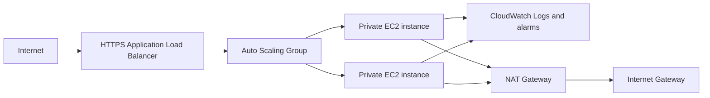

# Production AWS Web Application

Terraform configuration for a highly available NGINX application on AWS. It uses two Availability Zones, a public Application Load Balancer, and an Auto Scaling group in private subnets.

## Architecture



## Deployment

1. Install Terraform 1.6 or newer and configure AWS credentials with permission to create the listed resources.
2. Copy `environments/prod/terraform.tfvars.example` to `environments/prod/terraform.tfvars`.
3. Replace the ACM certificate ARN and budget email address. The certificate must be issued in the deployment region.
4. Run the following from `environments/prod`:

   ```sh
   terraform init
   terraform plan
   terraform apply
   ```

5. Open the `application_url` Terraform output after the load balancer health checks pass.

## Design decisions

- The ALB is internet-facing in two public subnets and accepts HTTPS only.
- Instances are launched only in private subnets, with no public IP addresses. Outbound package access goes through a NAT Gateway.
- The Auto Scaling group maintains at least two instances and uses target-tracking scaling at 60% average CPU.
- The launch template requires IMDSv2 and encrypts the root EBS volume with the default EBS KMS key.
- EC2 instances receive an IAM role for Systems Manager and CloudWatch Agent; no static access keys are used.
- The CloudWatch agent forwards NGINX access and error logs. CPU and unhealthy-target alarms can notify supplied SNS topics through `alarm_actions`.
- A monthly AWS Budget sends a forecast-based alert at 80% of the configured limit.

## Cost estimate

For an always-on two-instance deployment in `ap-south-1`, expect roughly USD 55–85 per month before data transfer, taxes, and optional managed services. The NAT Gateway and its data processing charge are material contributors. For lower non-production cost, use one NAT Gateway only as implemented, small instances, and short log retention. For sustained production use, evaluate Graviton instances, Savings Plans, and a NAT Gateway per Availability Zone.

## Security and operations

- Keep `terraform.tfvars`, state files, and credentials out of source control.
- Restrict `allowed_cidr_blocks` to known corporate or customer networks where possible.
- Supply SNS topic ARNs in `alarm_actions` to route alarms to the on-call path.
- Set `deletion_protection = false` only when intentionally tearing down the load balancer.

## Production readiness

The baseline covers multi-AZ placement, private compute, HTTPS termination, encrypted root volumes, least-privilege network paths, IMDSv2, health checks, scaling, central logs, alarms, a budget notification, and CI formatting/validation. Before a full production launch, configure a remote encrypted Terraform state backend with locking, DNS, WAF, an incident-response notification target, backups, and a second NAT Gateway if zonal egress resilience is required.
